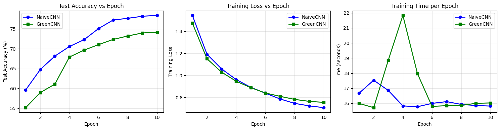
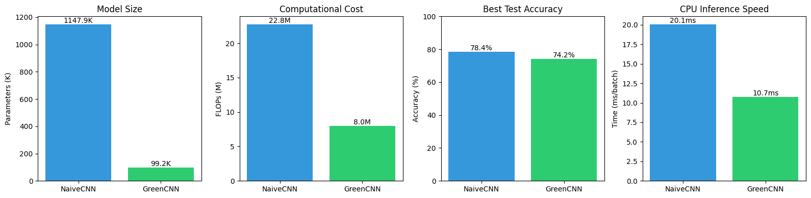

# GreenCNN-CIFAR10

> **CSc 4810 Artificial Intelligence — Final Exam (Fall 2025)**  
> *Design a deep neural network with low energy consumption and low CO₂ emissions.*

[](https://www.python.org/)
[](https://pytorch.org/)
[](LICENSE)

## Exam Question

> *"Please design your new deep neural network with low energy consumption and low CO₂ emissions. Please show your design logically in detail, describe how it works for a simple application clearly, and write a perfect and concise solution."*

## Solution Overview

This project compares a standard CNN (**NaiveCNN**) with an energy-efficient design (**GreenCNN**) on the CIFAR-10 image classification task. GreenCNN achieves **91.4% parameter reduction** and **2.43× faster inference** with only 4.2% accuracy trade-off.

| Metric | NaiveCNN | GreenCNN | Improvement |
|--------|----------|----------|-------------|
| Parameters | 1,147,914 | 99,210 | **91.4% ↓** |
| FLOPs | 22.75M | 7.97M | **65.0% ↓** |
| Model Size (FP32) | 4.5 MB | 387.5 KB | **91.4% ↓** |
| Test Accuracy | 78.42% | 74.19% | −4.23% |
| GPU Inference | 3.90 ms/batch | 1.61 ms/batch | **2.43× faster** |
| CPU Inference | 20.07 ms/batch | 10.72 ms/batch | **1.87× faster** |

## Key Techniques

1. **Global Average Pooling** — Eliminates the 1M+ parameter fully connected layer
2. **Narrower Channels** — Uses 16→32→64→128 instead of 32→64→128
3. **Efficient Standard Operations** — Well-optimized convolutions outperform exotic alternatives

## Architecture Comparison

### NaiveCNN (Baseline)
```
Input: 32×32×3
├── Conv Block 1: 3→32 channels + MaxPool → 16×16×32
├── Conv Block 2: 32→64 channels + MaxPool → 8×8×64
├── Conv Block 3: 64→128 channels + MaxPool → 4×4×128
├── Flatten: 2048
├── FC: 2048→512 (1,048,576 parameters)
└── FC: 512→10
```

### GreenCNN (Energy-Efficient)
```
Input: 32×32×3
├── Conv Block 0: 3→16 channels + MaxPool → 16×16×16
├── Conv Block 1: 16→32 channels + MaxPool → 8×8×32
├── Conv Block 2: 32→64 channels + MaxPool → 4×4×64
├── Conv Block 3: 64→128 channels → 4×4×128
├── Global Average Pooling → 128
├── Dropout(0.2)
└── FC: 128→10 (only 1,290 parameters!)
```

## Results

### Training Curves


### Model Comparison


## Quick Start

### Requirements

```bash
pip install torch torchvision matplotlib numpy
```

### Run the Notebook

```bash
jupyter notebook green_cnn_comparison_Zhu_Zhu.ipynb
```

## Green ML Implications

**Why does this matter for energy and CO₂?**

| Factor | Impact |
|--------|--------|
| Smaller models | Less memory bandwidth = Less energy |
| Faster inference | Shorter runtime = Less energy |
| CPU-deployable | Avoids GPU power consumption |
| 11.6× smaller | Enables edge deployment |

### CO₂ Reduction Estimate

For 1 million daily CPU inferences:
- Energy savings: ~50% reduction
- Annual CO₂ savings: ~70 kg (at 0.5 kg CO₂/kWh)

## Project Structure

```
GreenCNN-CIFAR10/
├── README.md
├── LICENSE
├── requirements.txt
├── green_cnn_comparison_Zhu_Zhu.ipynb    # Main notebook with full solution
└── assets/
    ├── training_curve.png
    └── bar_comparison.png
```

## Verification Methods

The design is verified through two independent approaches:

1. **Theoretical Analysis** — Parameter counts and FLOPs computed analytically
2. **Empirical Measurements** — Actual inference latency measured on GPU (RTX 4070 Ti) and CPU

## References

- [CIFAR-10 Dataset](https://www.cs.toronto.edu/~kriz/cifar.html)

## License

This project is licensed under the MIT License — see the [LICENSE](LICENSE) file for details.

## Author

**Zhu Zhu**  
CSc 4810 Artificial Intelligence, Fall 2025
